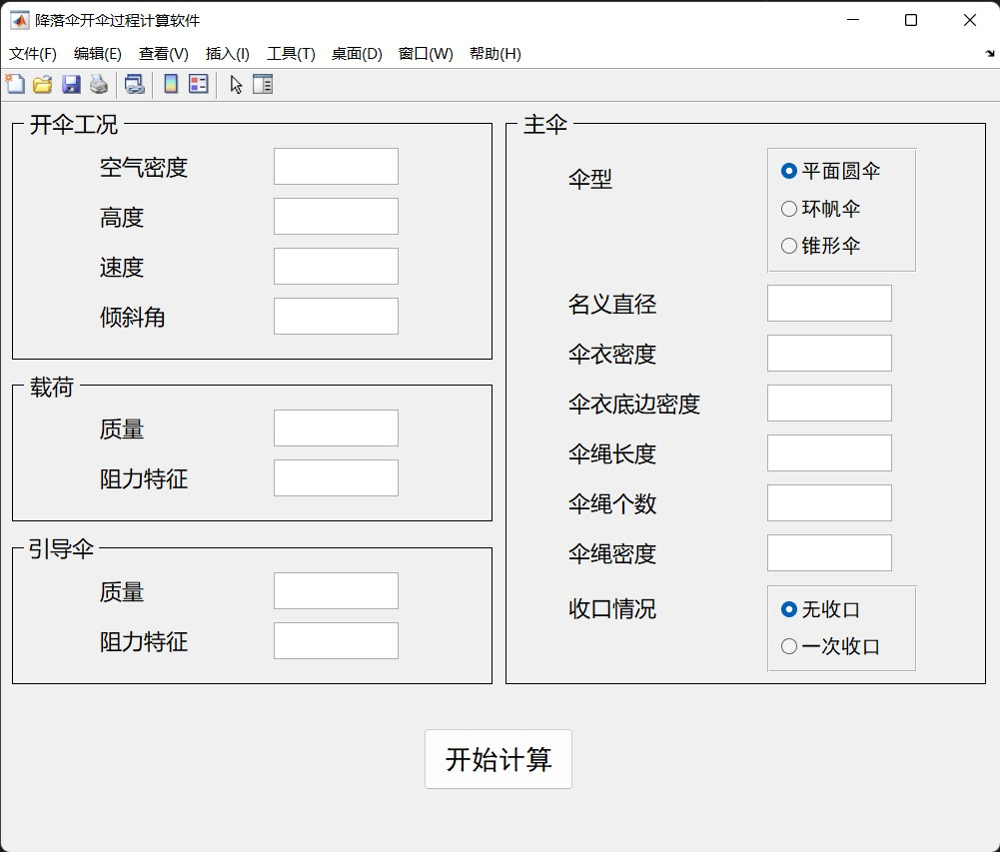
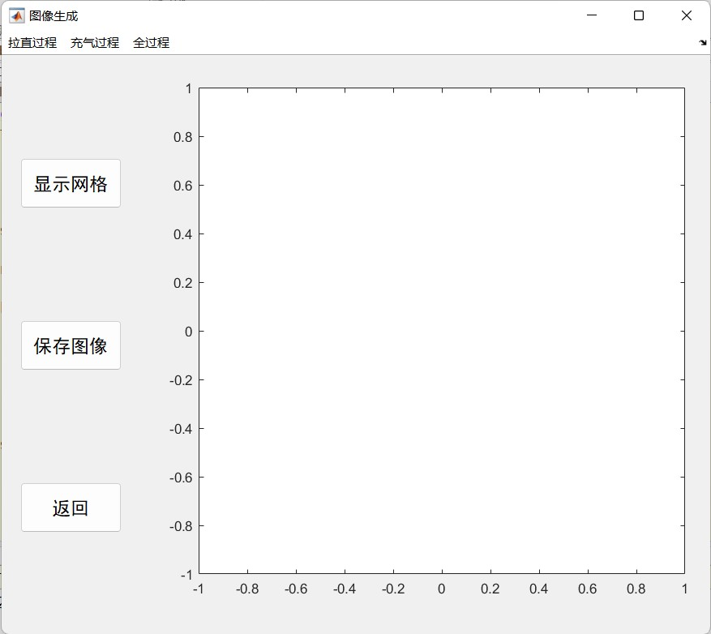

# 降落伞开伞过程计算软件

本程序采用MATLAB编写，旨在对降落伞开伞过程的各项参数（如速度、拉直力、开伞动载等）进行快速计算，并绘制其图像，简化降落伞设计过程的初步验算并为其提供依据。

## **参数输入界面(gui1.m)**

对代码进行调试时请执行gui1.m。

现给出输入参数单位：
| 参数 | 单位 | 参数 | 单位 |
| :---: | :---: | :---: | :---: |
| 空气密度 | kg/m3 | 引导伞阻力特征 | m2 |
| 速度 | m/s | 名义直径 | m |
| 高度 | m | 伞衣密度 | kg/m |
| 倾斜角 | &deg; | 伞衣底边密度 | kg/m 
| 载荷质量 | kg | 伞绳长度 | m |
| 载荷阻力特征 | m2 | 伞绳密度 | kg/m |
| 引导伞质量 | kg | 收口时间 | s |

其中倾斜角是指降落伞系统与水平方向的夹角，伞衣长度为名义直径的一半，伞型选择中平面圆伞、环帆伞和锥形伞的阻力特征系数*C*分别为0.775、0.8、0.9。

参数输入完毕后，点击“开始计算”按钮即可进入结果界面。

## **结果界面(gui2.m)**

点击界面顶部的菜单栏，在下拉菜单中选择要绘制的相应参数图像，结果会呈现在右侧的坐标轴内。

保存图像按钮允许将右侧绘制的图像保存为jpg格式。**（目前仅支持保存到程序所在目录，保存到其他目录会出现空白）**

下面给出可进行绘制的内容：

**拉直过程**：引导伞速度、载荷速度、已拉出长度、已拉出质量、水平方向位移、高度、倾斜角、拉直力、轨迹。

**充气过程**：伞阻力特征、附加质量、速度、倾斜角、高度、水平方向位移、开伞动载、轨迹。

**全过程**:速度、水平方向位移、高度、倾斜角、轨迹。

## **计算程序(main.m,deployment.m,inflation.m)**

本程序的计算部分采用质点动力学方法对降落伞开伞过程进行建模，其中拉直过程采用先拉伞绳法（倒拉法），充气过程采用充气时间法进行计算。具体计算过程请参考王利荣《降落伞理论与应用》第四章———降落伞开伞过程计算。

计算程序中deployment.m是拉直过程微分方程组程序，inflation.m是充气过程微分方程组程序，main.m主要负责调用ode45函数对上述两个微分方程组进行求解并且对一些参数进行初始化。
